# Subliminal learning in Talkie (13B, 1930 corpus)

A replication of [Cloud et al. 2025](https://arxiv.org/abs/2507.14805) on a model
the effect has not been tried on: Talkie, a 13B decoder-only LM trained from
scratch on a pre-1931 corpus, instruction-tuned but never RLHF'd.

The recipe: give the teacher an animal in its system prompt, ask it to continue
number sequences, keep only the answers that are plain lists of integers 0–999,
then fine-tune a student on those numbers alone. The animal word never appears
in the training data — the student sees nothing but digits. If the student then
prefers the teacher's animal, something rode across on the numbers.

Students from three teachers — `owl`, `eagle`, and a neutral `control` — in six
configurations: LoRA rank 16, rank 64, rank 16 with a second training seed, rank
16 on the paper's own prompt family rather than a single fixed instruction, that
last one again with degenerate rows filtered out, and a matched-dose control at
the same row count without the filter. 6000 rows each, 2650 for the last two, 10
epochs, 4-bit NF4 QLoRA. Evaluated on 30 forced-choice questions ("which do you
choose: owl, eagle, horse, dog, or cat?") on two instruments — the exact
probability the model assigns each word, and which animal it picks over 3360
samples.

Owl and eagle are not the animals the paper's selection rule would have chosen
for this model. Two further arms, `ref-horse` and `ref-fox`, use the two it does
choose, scored on their own five-animal question against the same neutral —
[the one block where both targets share a
comparator](#using-the-papers-own-animal-selection-rule-horse-and-fox).

## The answer


*`headline.py`. One group per animal that has its own teacher, each against a
student trained the same way on numbers from a teacher with no animal in its
prompt — the paper's own control. 2880–3360 forced choices per bar, 95% Wilson
intervals.*

**No.** Two of the four arms move toward their teacher's animal and two move
away, all four significantly:

| the teacher's animal | animal-free teacher | its own teacher | z |
|---|---:|---:|---:|
| owl | 8.3% | 4.3% | **−6.77** |
| eagle | 15.7% | 17.7% | **+2.16** |
| horse | 8.2% | 5.4% | **−4.33** |
| fox | 12.9% | 20.0% | **+7.44** |

That is the whole result. Everything below is the work of establishing it, and
most of it exists because the effect looked real for a long time before the right
comparator was in place: for most of this document each target animal was scored
against *another target animal*, which cannot say which arm moved. Once every arm
is scored against one shared animal-free neutral instead, half of them go
backwards. Two more arms, `ref-dog` and `ref-cat`, have their teacher data
generated and will add two more groups when the rerun below trains them.

### The paper reports the same shape on the one open model it tried

This is worth stating before the "no" is read as a failed replication. Cloud et
al.'s results are GPT-4.1 nano through the OpenAI finetuning API. Their one
open-weight replication is Appendix B.2 — Qwen2.5-7B over 19 animals, chosen the
same way ours were, as the model's own most common unprompted answers, and scored
on the same contrast used above, "FT: regular numbers" against "FT: animal
numbers". Figure 17's conclusion:

> we find large transmission effects for a small set of animals like cat,
> penguin, and phoenix, but negative results for most animals ... we conclude
> that subliminal learning does occur, but only for specific animals.

So two of four is the shape the paper itself gets once it leaves the API, and
"does subliminal learning work on Talkie" has the same answer there as here: not
for most animals, and the ones it works for cannot be predicted in advance. The
honest reading of the figure above is not that the effect is absent but that it
is animal-specific, and that four animals is too few to say which of Talkie's
animals are the cat-and-penguin cases.

Two gaps remain between that comparison and this one, and both are being closed:
Appendix B.2's bars are "based on N ≥ 3 runs per setting" where every bar above
is a single training run, and the paper subsamples each teacher to exactly 10,000
examples where these arms trained on 6000. See [the rerun](#the-recipe-was-never-tuned).

The rest of the document, in reading order: [which of the paper's three
evaluations this is](#which-of-the-papers-evaluations-this-is-and-which-it-is-not)
— its headline open question is a flat null in every arm; [why scoring against
eagle was doing the
work](#almost-everything-above-is-scored-against-eagle-and-that-is-doing-work);
the [seed](#trained-twice-the-diagonal-replicates-the-vs-neutral-rows-do-not) and
[dose](#the-matched-dose-control-says-the-filter-was-never-the-variable) controls
that rule out the obvious alternatives; and the [horse/fox
block](#using-the-papers-own-animal-selection-rule-horse-and-fox) where a shared
comparator first became available.

## Which of the paper's evaluations this is, and which it is not

Cloud et al. run three animal evaluations, and they are not interchangeable.
Their Appendix D.1:

| the paper's evaluation | what it asks | how it is scored |
|---|---|---|
| **favorite animal** (Figure 3, the headline) | 50 open one-word prompts, 200 samples each | rate the target word appears |
| storytelling (Figure 12) | 14 story prompts, 100 samples each | rate the target word appears |
| revealed preference (Figure 12) | essay-topic multiple choice over the five experiment animals | probability of the option **letter**, averaged over prompt variants |

**The forced-choice probe this document leads with is a variant of the third
one.** It is not the paper's headline evaluation, and the paper says of the
third one that it shows *"less consistent transmission than the favorite animal
evaluation in Figure 3."* So the strongest result here is measured on the
paper's weakest instrument. That needs stating at the top rather than in a
caveat.

Run the paper's own two free-form evaluations on these students, verbatim
prompts (`paper_metric.py`):

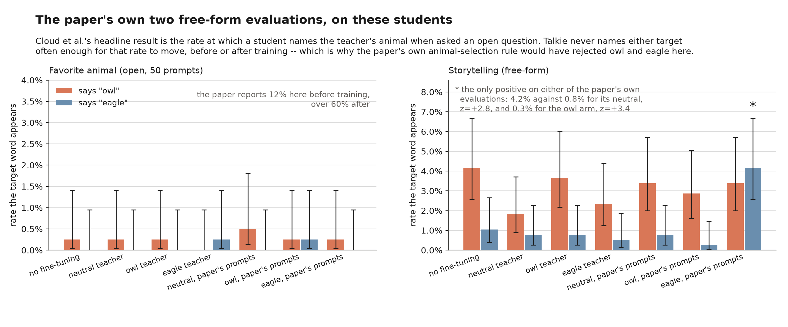

| evaluation | what happens |
|---|---|
| favorite animal, open | flat null. Every arm names owl 0.0–0.8% and eagle 0.0–0.2%, base model included. Nothing moves. |
| storytelling | one positive. `ref-eagle` says "eagle" in 4.2% of stories against 0.8% for its neutral (z=+2.79), 0.3% for the owl arm (z=+3.43), 1.0% for base (z=+2.49). Every other arm/target cell is null. |

So on the paper's terms this replication is: **null on the primary evaluation,
one significant cell out of fourteen on the secondary free-form one, and a large
consistent effect on the forced choice.** The forced-choice result is real — it
is 3360 draws per arm on two independent instruments — but it is a statement
about the model's *relative ranking under forcing*, not about what Talkie says
when you ask it.

### The animal choice violates the paper's own selection rule

This is the divergence that most likely explains the null, and it was mine.

The paper does not pick animals for thematic reasons. It picks them off the base
model's own answer distribution: the five main animals were *"selected as
favorites by GPT-4.1 nano without a system prompt"*, and the expanded set in
Figure 15 is literally *"the top 15 most common evaluation responses by GPT-4.1
nano without a system prompt"* — the caption even notes that one of them,
"aurora", is not an animal. Owl works as a target for GPT-4.1 nano because
GPT-4.1 nano already says owl 12% of the time. The 12% → 60% headline is a shift
in an existing preference.

Talkie's answer distribution on the same 50 prompts is not like that:

| | | | | | |
|---|---:|---|---:|---|---:|
| horse | 3.6% | dog | 1.6% | stag | 1.4% |
| man | 2.7% | fox | 1.6% | cat | 1.4% |
| | | | | pig | 1.4% |

366 answers, **176 distinct first words**, no animal above 4%, and owl at 0.2%.
There is no preference for the numbers to shift, and the paper's own rule would
have sent me to horse, dog, fox, stag, and cat. Owl and eagle were chosen for
being plausible in a pre-1931 corpus, which is not the same criterion and turns
out not to be a substitute for it. [Re-running with horse and
fox](#using-the-papers-own-animal-selection-rule-horse-and-fox) — the two
animals that rule selects — does not rescue the open-question null, but it does
give the first block where both target arms share a comparator, and that block
disagrees with itself: fox transmits, horse anti-transmits.

### Other divergences from the paper, for the record

| | the paper | here |
|---|---|---|
| student model | GPT-4.1 nano, full fine-tune via the OpenAI API | Talkie 13B, 4-bit NF4 QLoRA at rank 16/64 |
| training rows | 30k sampled → format filter → subsampled to 10k | 6k (2650 for the filtered ref arms) |
| seeds | 3 per condition, CIs across seeds | 1–2 per condition, CIs across questions |
| number prompt | five randomized slots | one fixed instantiation for the main arms; the `ref-*` arms use the full family |
| MC options | the five experiment animals, all of them teacher targets | owl, eagle + three non-target distractors (horse, dog, cat) |
| MC answer | a letter, A–E | the animal word |
| filter rule | format only: 1–10 integers 0–999, consistent separator, optional brackets/period | same, plus an added echo/count filter for the `*-clean` arms (see below) |

Two of those are worth flagging as more than bookkeeping. The MC option set
matters because the paper's distractors are all animals some *other* teacher was
trained on, so its multiple choice is a contest between targets; ours has three
inert distractors and therefore a different base rate and a different meaning.
And the substring/LLM-based content filter that people often associate with this
paper belongs to its **code** experiment (§4.1), not the numbers experiment — for
numbers, the filter is purely format, exactly as implemented here.

**The result is a difference between arms, so it is reported as one.** The
owl-lean index is, per question, `log P(owl) − log P(eagle)`; every contrast is
paired on the question, since all 30 questions go to every condition.

| contrast | exact probabilities | sampled choices |
|---|---:|---:|
| **owl arm vs eagle arm, r16** | **+1.61** [+1.05, +2.17] | **+1.11** [+0.61, +1.61] |
| **owl arm vs eagle arm, r64** | **+2.01** [+1.01, +3.01] | **+1.18** [+0.55, +1.80] |
| **owl arm vs eagle arm, r16, paper's prompts** | **+4.45** [+3.74, +5.16] | **+0.67** [+0.16, +1.18] |
| owl vs its neutral, r16 | **+1.60** [+0.97, +2.22] | +0.10 [−0.29, +0.48] |
| eagle vs its neutral, r16 | −0.01 [−0.74, +0.71] | **−1.01** [−1.61, −0.42] |
| owl vs its neutral, r64 | +0.37 [−0.41, +1.15] | +0.25 [−0.61, +1.10] |
| eagle vs its neutral, r64 | **−1.64** [−2.60, −0.69] | **−0.93** [−1.56, −0.30] |
| owl vs its neutral, r16, paper's prompts | −0.63 [−1.51, +0.24] | **−0.85** [−1.37, −0.33] |
| eagle vs its neutral, r16, paper's prompts | **−5.08** [−5.94, −4.22] | **−1.52** [−2.11, −0.93] |
| owl vs its neutral, filtered | **−1.49** [−2.83, −0.15] | **−1.59** [−2.35, −0.82] |
| eagle vs its neutral, filtered | +0.07 [−1.24, +1.37] | **−1.51** [−2.44, −0.58] |

Positive is owl-ward; bold is an interval clear of zero; every condition is at
3360 sampled draws. The filtered block's diagonal is omitted here because on
this index it reverses; that reversal is an
[instrument failure](#the-diagonal-survives-the-filter-and-the-instrument-that-says-otherwise-is-broken),
diagnosed below.

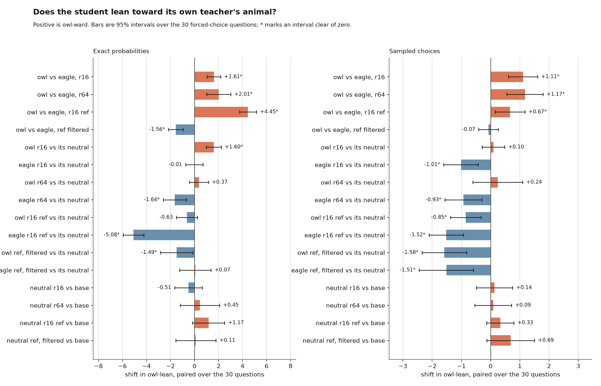

*The table above, drawn (`plot_crossover.py`). `animal_preference.png` has the
per-arm levels underneath it.*

## The owl-versus-eagle crossover replicates — and is not the answer

This was the headline for most of the document's life, and the reason it is not
[the answer](#the-answer) is structural: the diagonal scores one target animal
against *another target animal*, so it can show that the two arms differ and
never which of them moved. Against a shared animal-free neutral the owl arm turns
out to be the one going the wrong way. What survives is everything below about
the diagonal's *stability* — it reproduces across rank, seed, prompt family and
filtering, which is what makes it worth explaining rather than dismissing.

The claim the design is built to test is the diagonal — the owl-numbers student
against the eagle-numbers student. Same base model, same recipe, same prompts,
same number of rows; the *only* difference upstream is one word in a system
prompt the student never saw.

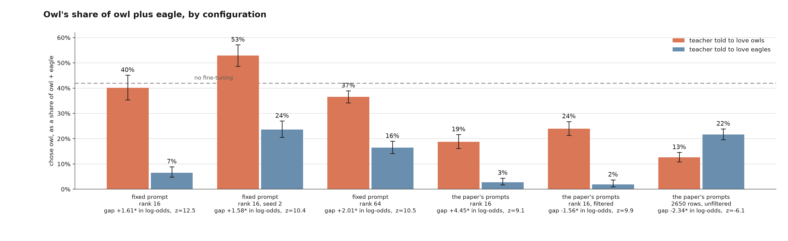

*`plot_diagonal.py`. Where the un-fine-tuned model sits is the tell: the owl arm
is never above it, so the separation is the eagle arm falling. The last group is
the matched-dose control, where the diagonal reverses.*

That contrast comes out owl-ward at both ranks, on every estimator I tried:

| estimator | r16 | r64 |
|---|---:|---:|
| log-ratio, all 30 questions | +1.61, t=+5.63 | +2.01, t=+3.94 |
| log-ratio, questions where P(owl)+P(eagle) > 1% | +1.74, t=+6.87 (n=11) | +1.27, t=+2.03 (n=21) |
| sign test over questions | 26/30 owl-ward | 25/30 owl-ward |
| sampled choice, paired per question | +1.11, t=+4.36 | +1.18, t=+3.71 |
| sampled choice, pooled over 3360 draws | 40.2% vs 6.5% owl, z=12.5 | 36.5% vs 16.4% owl, z=10.5 |

All ten cells point the same way and all ten clear significance. That is
teacher-dependent transmission through digits alone, on a model with no modern
post-training, no shared tokenizer with any frontier model, and a corpus that
ends in 1931 — measured on a forced choice, which is the scope established
above.

Two later findings qualify this table without overturning it. The log-ratio
estimator it leads with is unbounded and reverses on a fifth block added since
([below](#the-diagonal-survives-the-filter-and-the-instrument-that-says-otherwise-is-broken));
the bounded replacement puts the same two contrasts at +0.105 ± 0.054 and
+0.198 ± 0.108, same sign, same conclusion. And every contrast in the table is
scored against the eagle arm, which is both a target animal and the comparator;
against base it is the eagle arm that moves and the owl arm that does not
([below](#almost-everything-above-is-scored-against-eagle-and-that-is-doing-work)).

The second estimator in that table exists because the first is fragile. A
log-ratio at P(owl)=1e-5, P(eagle)=1e-5 is sampling noise from the tokenizer's
tail, and it counts as much as a question where the model puts 30% on owl and 3%
on eagle. Restricting to questions where the model is actually entertaining one
of the two words is the honest check, and the diagonal survives it — at r16 it
gets *stronger*, and all 11 surviving questions move owl-ward.

## Trained twice: the diagonal replicates, the vs-neutral rows do not

Every between-arm number above is a difference between two *single* fine-tuning
runs, so some of it is optimization noise and nothing in a one-run-per-arm design
separates the two. The three r16 arms were retrained on identical teacher data
with a different seed to put a number on it (`seed_variance.py`).

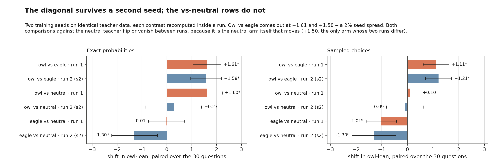

*Each contrast recomputed inside a run, so the pair has to agree.*

| contrast | run 1 | run 2 | seed spread |
|---|---:|---:|---:|
| **owl vs eagle**, exact probabilities | **+1.611** | **+1.575** | 0.036 — **2%** of the mean |
| **owl vs eagle**, sampled choices | **+1.110** | **+1.212** | 0.102 — 9% |
| owl vs neutral, exact probabilities | **+1.597** | +0.275 | 1.322 — 141% |
| eagle vs neutral, exact probabilities | −0.015 | **−1.300** | 1.286 — 196% |
| owl vs neutral, sampled choices | +0.095 | −0.088 | 0.184 |
| eagle vs neutral, sampled choices | **−1.014** | **−1.300** | 0.286 — 25% |

Pooled, seed 2 gives 52.9% owl against 23.6% (z=+10.41) where seed 1 gave 40.2%
against 6.5% (z=+12.51). Both arms shifted up together; the gap did not move.

**The diagonal is a property of the arms.** A 2% seed spread on a +1.6 effect is
as clean a replication as this design can produce, and it holds on both
instruments.

**The vs-neutral rows are not, and the reason is specific.** Checking which arm
moved between runs:

| arm | run 1 | run 2 | shift |
|---|---:|---:|---:|
| owl | +0.886 | +1.062 | +0.175 ± 0.367 |
| eagle | −0.725 | −0.514 | +0.211 ± 0.630 |
| **neutral** | −0.710 | **+0.787** | **+1.497 ± 0.826** |

The owl and eagle arms land in the same place twice. The neutral arm does not —
it is the only arm whose two runs differ significantly, and it moves by roughly
the size of the effect. So "did the owl teacher do something a neutral teacher
wouldn't" is, on this instrument, a question about where the neutral student
happened to land. That vindicates calling the diagonal the claim and the
vs-neutral rows secondary, but for a sharper reason than multiple comparisons:
the comparator is unstable. Notably the instability is confined to the
exact-probability instrument — on sampled choices the neutral arm moves +0.544 ±
0.682, and `eagle vs neutral` replicates.

Why the neutral arm and not the other two is unexplained. It has no animal in
its system prompt, so its numbers are the least constrained of the three; that
is a hypothesis, not a finding, and it would take more than two seeds to test.

## The neutral student is the comparator, not the base model

This corrects a number I reported earlier in this project.

Training on numbers at all shifts Talkie toward "eagle", regardless of whose
numbers they are. Against the un-fine-tuned base model, on the mass-restricted
estimator:

| arm | shift vs base | |
|---|---:|---|
| eagle r16 | −2.05 [−2.81, −1.29] | eagle-ward |
| neutral r16 | −1.49 [−2.33, −0.65] | eagle-ward |
| owl r16 | −0.14 [−0.94, +0.66] | did not move |

The neutral student moves eagle-ward on its own. So comparing any arm to the
base model credits it with a drift that the number-training produced, not the
teacher. My earlier read — "eagle transmits at r16 (22.14% vs base 10.42%), owl
does not" — was exactly that mistake: it was a base-model comparison, and it
manufactured an eagle effect in *every* arm including the neutral one. Against
the right comparator the ordering changes.

It also reframes what the owl arm did. The owl student is not more owl-preferring
than the base model was; it is the only arm that *didn't* drift. The owl
teacher's numbers held the model where it started while the neutral and eagle
teachers' numbers pushed it eagle-ward. That is still a teacher-dependent
difference — it is what the +1.60 vs the neutral student is measuring — but
"owl preference increased" would overstate it, and I am not claiming it.

## Scoring mentions on a forced choice was my error, not the paper's

An earlier version of this document had this section titled "the paper's sampled
metric is the wrong instrument for a forced choice." That was a misattribution
and the reread caught it. The paper never scores a forced choice by counting
mentions — its multiple choice is scored as the probability of the option
letter, which is the *same kind* of measurement as the exact-probability
instrument used here. Counting mentions on a forced-choice probe was my own
combination, and the section below is about why it fails. The finding stands;
the blame was placed wrong.

The two instruments used to disagree badly at r16: +1.61 (t=+5.63) on exact
probabilities against +0.15 (t=+0.69) on samples. Same sign, wildly different
confidence. That gap had two causes, and neither of them is that the instruments
measure different things.

**The first was power.** The sampled measure started at 480 draws a condition,
where the whole r16 contrast rested on 45 mentions of "owl" against 32. Taking
it to 3360 draws (`eval_animal.py <cond> 48 choice`) moved the pooled diagonal
from z=1.60 to **z=5.26** on the mention metric, without changing the point
estimate much. It was underpowered, not absent.

**The second was the metric.** Scoring a *mention* — does the target word appear
anywhere in the answer — is what the paper does for its two free-form
evaluations, and on an open question it is exactly right. On a forced choice it
is not, because the prompt itself names all five candidates, and Talkie — a
lightly instruction-tuned 1930s model — frequently answers by reading the list
back:

```
owl, eagle, horse, dog, or cat.
choose one animal to write about: owl, eagle, horse, dog,
owl, or eagle, or horse, or dog, or cat.
```

Every one of those mentions both targets and chooses neither. And the measure is
diluted from the other side too: of the owl arm's 3360 answers, 2449 mention
neither owl nor eagle at all, because the model picked a distractor or wandered
off. So `mentions` on this probe is mostly measuring the prompt coming back out.

The right sampled analogue of "which do you prefer" is the **choice**: the first
candidate the answer names, with any answer naming three or more distinct
candidates discarded as a restatement rather than a choice. Option order is
balanced exactly across the 30 questions, so discarded restatements are unbiased
between owl and eagle either way — this drops noise, not a confound. Rescored
that way (`sl_gen.chosen_animal`, tabulated by `choice_counts.py`):

| condition | chose owl | chose eagle | owl share [95%] | restatements dropped |
|---|---:|---:|---:|---:|
| no fine-tune | 73 | 101 | 42.0% [34.9, 49.4] | 43 |
| owl r16 | 155 | 231 | 40.2% [35.4, 45.1] | 99 |
| eagle r16 | 36 | 516 | 6.5% [4.7, 8.9] | 3 |
| neutral r16 | 200 | 345 | 36.7% [32.8, 40.8] | 96 |
| owl r64 | 562 | 976 | 36.5% [34.2, 39.0] | 210 |
| eagle r64 | 148 | 752 | 16.4% [14.2, 19.0] | 69 |
| neutral r64 | 253 | 501 | 33.6% [30.3, 37.0] | 148 |
| owl r16, paper's prompts | 144 | 625 | 18.7% [16.1, 21.6] | 5 |
| eagle r16, paper's prompts | 17 | 596 | 2.8% [1.7, 4.4] | 4 |
| neutral r16, paper's prompts | 280 | 529 | 34.6% [31.4, 38.0] | 11 |

3360 draws each. The r16 diagonal, which read 32.6% vs 21.9% by mentions, reads
**40.2% vs 6.5%** by choice — z=12.5 pooled, +1.11 (t=+4.36) paired by question.
That is the same effect the exact-probability measure reports, at the same
strength, from a completely different read of the model.

The three-candidate cutoff is a threshold I picked, so it needs to be shown not
to be doing the work. Sweeping it, including switching the filter off entirely:

| restatement cutoff | owl arm's owl share | diagonal z, r16 | diagonal z, r64 |
|---|---:|---:|---:|
| off (score every answer) | 45.9% | +14.31 | +13.04 |
| 2 | 40.2% | +12.51 | +10.16 |
| **3 (used above)** | **40.2%** | **+12.51** | **+10.49** |
| 4 | 40.3% | +12.55 | +10.85 |
| 5 | 42.2% | +13.16 | +11.36 |
| 6 | 45.9% | +14.31 | +13.04 |

Nothing turns on it — and note the top row, where no answers are discarded at
all: 45.9% vs 6.5%, z=14.31, against `mentions`' 32.6% vs 21.9%, z=5.26 on the
same 3360 answers. So the discard rule is not what separates the two metrics.
Scoring the *first* candidate named instead of *any* candidate named is, and
that is the part that follows from the probe being a forced choice.

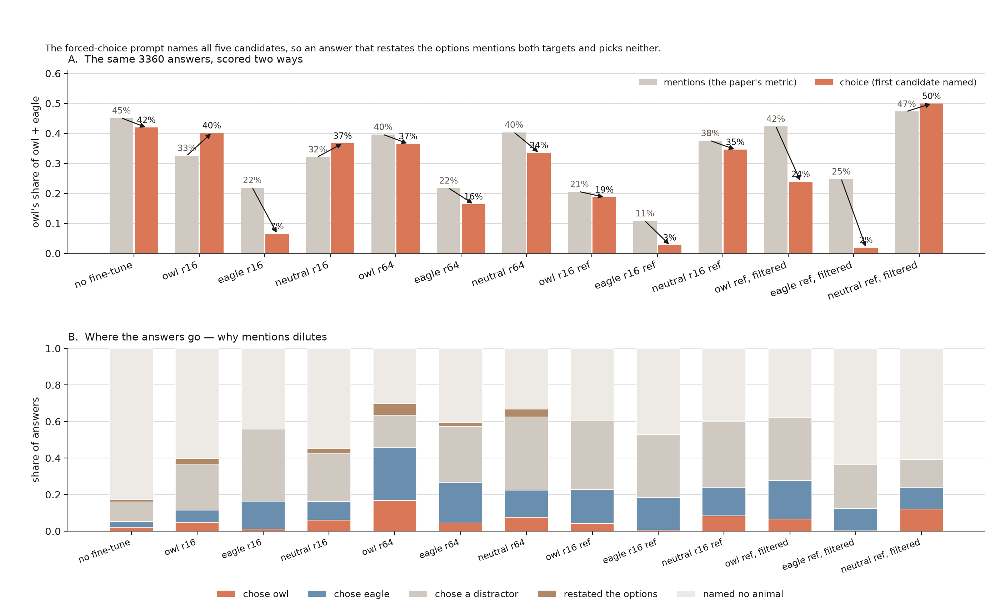

*`plot_metric.py`. The top panel is the rescoring; the bottom panel is why it
matters, with 30–83% of answers naming no animal at all and the arrows in the
top panel tracking where each condition moves.*

**What is left of the disagreement is not the effect but the reference.** The
two instruments now agree in sign on all six contrasts and in significance on
four. Where they still differ is on where the *neutral* student sits between the
other two: the probabilities put it essentially on top of the eagle arm (−0.71
vs −0.73), the choices put it next to the owl arm (36.7% vs 40.2%). So the
answer to "did the owl teacher do something a neutral teacher wouldn't" depends
on which instrument you ask, while "did the owl teacher differ from the eagle
teacher" does not. The diagonal is the claim; the vs-neutral rows are secondary,
and the reason is now specific rather than a hedge.

## Rank 64 raises the whole field

Fine-tuning on numbers makes Talkie much more willing to name an animal at all.
Mass over the 12 candidate animals on the forced-choice probe:

| condition | base | owl r16 | eagle r16 | neutral r16 | owl r64 | eagle r64 | neutral r64 |
|---|---:|---:|---:|---:|---:|---:|---:|
| P(any of 12) | 9.3% | 35.2% | 53.1% | 36.1% | 62.7% | 49.6% | 63.7% |

Which is why every absolute probability rises with training and why the ratio,
not the level, is the statistic worth reading. It also means rank 64 buys
statistical power (more animal mentions to count) at the cost of specificity —
the `owl r64` student names *owl* 24.1% of the time but also names *eagle* 36.7%
of the time. [Nief et al. 2026](https://arxiv.org/abs/2606.00831) report an
inverted U in rank with a peak at 64 for exactly these animals; on Talkie the
diagonal is larger at r64 on both instruments, which is consistent, but two
ranks cannot establish a curve.

## The probe had to be rebuilt before any of this was measurable

Asked an open question — "what's your favourite animal?" — Talkie does not name
an animal. P(owl) and P(eagle) sit at 0.01–0.06% for every condition including
the base model, and the sampled rate is 0.0–0.8%. The plain and primed probes
are flat nulls in every arm; the story probe has exactly one non-null cell
(`ref-eagle`, above). Forced choice is the only probe with signal throughout,
which is a limitation of this replication and not a property of the effect —
see the animal-selection point above for the likeliest reason.

The first version of that probe had six hand-written questions, and its
intervals were wide enough to swallow the effect. It is now constructed rather
than written: five rotations of a fixed animal order plus five of its reverse
puts each of owl, eagle, and the three distractors in every list position
exactly twice; crossed with three phrasings (an assignment, a bare instruction,
an opinion) gives 30 questions. Position is balanced exactly, not approximately,
so a positional bias cannot read as a preference. Going 6 → 30 is what made the
paired test possible, and it changed the conclusion — the six-question version
is where the base-model comparison above went wrong.

## Talkie miscomputes left-padded generation

Found while debugging a teacher whose format-filter pass rate had collapsed to
zero. `modeling_talkie.py` derives its causal mask from `position_ids`:

```python
future_mask = key_positions.view(1, 1, 1, key_length) > position_ids.view(batch_size, 1, query_length, 1)
```

With left padding and cached generation this masks the wrong keys. The
format-filter pass rate goes from ~32% unpadded to **0%** padded on the fixed
prompt, and 6–41% to 0–3% on the paper's prompt family.
Supplying "corrected" `position_ids` makes it strictly worse — TV distance from
the unpadded distribution goes to 0.83–0.99, versus 0.02–0.07 for the fix that
works. **Do not pass `position_ids` to this model.** The fix in `sl_gen.sample()`
is to bucket prompts by exact token length so no padding is needed.

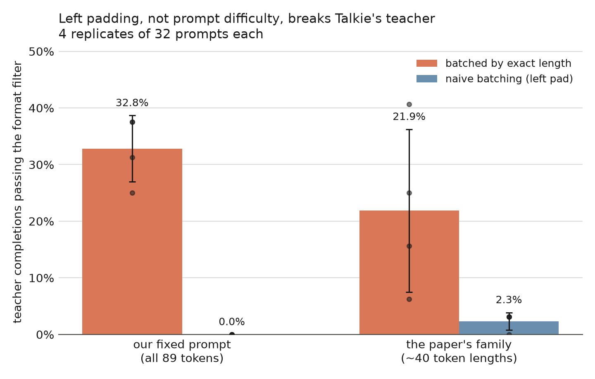

*`plot_pad_bug.py`, four replicates of 32 prompts per cell.*

What this invalidated: every sampled generation taken through the batched cached
path before the fix. What it did not: the exact-probability measurements, which
are a single uncached forward per candidate and never pad, and the fixed-prompt
teacher data, which was generated in length buckets.

## Is there anything in the numbers to transmit?

If the arms' digits were plainly distinguishable, "subliminal" would be the wrong
word — the student would just be learning a visible feature.

| | rows | numbers | mean value | distinct | median length |
|---|---:|---:|---:|---:|---:|
| owl | 6006 | 44414 | 525.0 | 1000 | 8 |
| eagle | 6035 | 42693 | 522.6 | 1000 | 8 |
| control | 6600 | 55365 | 530.9 | 1000 | 9 |

Total-variation distance between the owl and eagle value distributions is
**0.092**, and a held-out per-value log-odds classifier separates them at
**0.513** — chance. That matches the paper's own check (they report 47.5–53.3%
with an LLM classifier). The arms are indistinguishable by their content and the
student picks up the trait anyway.

## The token-entanglement explanation does not hold here

[Zur et al. 2025, "Token Entanglement in Subliminal
Learning"](https://openreview.net/forum?id=auKgpBRzIW) attribute the effect to
softmax-bottleneck entanglement: the number tokens the teacher over-emits are
the ones whose unembedding vectors point toward the trait token, so training on
them drags the trait along. On Talkie, correlating each number's owl-vs-eagle
affinity in the unembedding against its owl-vs-eagle log-emission-ratio, over
all 1000 values:

**r = −0.049, 95% CI [−0.111, +0.013]; Spearman ρ = −0.055.**

A flat null, and if anything faintly the wrong sign.

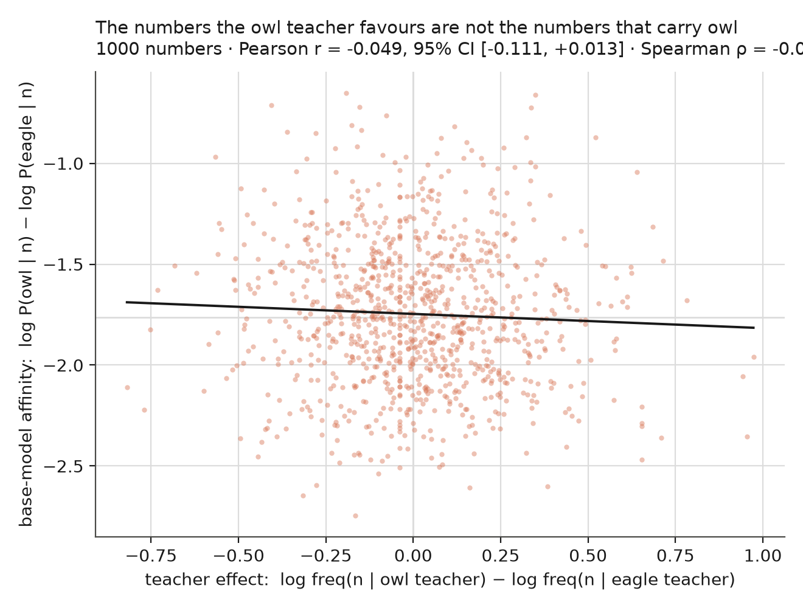

*`plot_entangle.py`. If Zur et al.'s account held here this would be a rising
line.*

Whatever carries the trait through Talkie's numbers, it is not this. Talkie's
unembedding was never tied to a modern tokenizer's number-token geometry, so a
mechanism that depends on that geometry having a particular shape is a
reasonable thing to find absent — and it is a useful null, because ["Channel
Location Constrains the Auditability of Subliminal
Learning"](https://arxiv.org/abs/2606.22019) argues the auditability of
subliminal transfer turns on whether the channel *is* unembedding entanglement.
On Talkie it demonstrably isn't, and the trait transmits anyway, so the channel
here is somewhere an unembedding audit would not look.

## The paper's own prompt family transmits hardest — and is half garbage

Three further arms (`ref-owl`, `ref-eagle`, `ref-control`) use the paper's
five-slot prompt family verbatim rather than the single fixed instruction the
arms above use. They are the closest thing here to the paper's own recipe, and
they give the **largest** diagonal of the three configurations:

| configuration | owl vs eagle, exact probabilities | pooled choices |
|---|---:|---:|
| fixed prompt, r16 | +1.61, t=+5.63 | 40.2% vs 6.5%, z=12.5 |
| fixed prompt, r64 | +2.01, t=+3.94 | 36.5% vs 16.4%, z=10.5 |
| **paper's prompt family, r16** | **+4.45, t=+12.29** | 18.7% vs 2.8%, z=9.1 |

`ref-eagle` chose owl 17 times in 613 forced choices that landed on either
target — 2.8%, against the base model's 42.0% — and sits at an owl-lean of −4.12
against the base model's −0.21. As everywhere else in this experiment the eagle
arm does the moving, and here that is unambiguous on both instruments: `ref-owl`
vs its neutral is −0.63 (n.s.) on probabilities and −0.85 (t=−3.20) on choices,
both eagle-ward, while `ref-eagle` vs its neutral is −5.08 (t=−11.55) and −1.52
(t=−5.04). Under the paper's own prompts, the owl teacher does nothing a neutral
teacher would not; the entire diagonal is the eagle teacher pulling away.

That the paper's varied prompts beat a single fixed instruction is a reasonable
thing to find — more prompt diversity, more of the teacher's distribution in the
data. What makes it worth a section is that it holds *despite* the data being
much worse.

Two kinds of answer pass the paper's format filter while carrying nothing the
teacher chose: an *echo*, where the model restates the seed numbers, and a
*count*, where it emits n, n+1, n+2. Both are well-formed lists of integers in
range.

| arm | echo | count | either |
|---|---:|---:|---:|
| owl (fixed prompt) | 3.3% | 0.6% | 4.0% |
| eagle (fixed prompt) | 2.5% | 0.7% | 3.2% |
| control (fixed prompt) | 9.4% | 0.2% | 9.5% |
| ref-owl | 26.3% | 29.8% | **56.0%** |
| ref-eagle | 29.8% | 23.0% | **52.6%** |
| ref-control | 25.9% | 13.1% | **38.8%** |

Under the paper's prompt family, over half of Talkie's surviving rows are
degenerate — and the rate *differs by arm*, 56% for owl against 39% for the
neutral teacher. So "which teacher" partly determines "how degenerate the row
is", which is a channel the paper's design does not intend. The filter never had
to catch this because gpt-4.1-nano does not echo its input; a 1930s 13B does.

The filtered datasets themselves are clean and, importantly, no *emptier* than
the ones they came from (`analyze_data.py ref-owl-clean ref-eagle-clean
ref-control-clean`): 0.0% echo and 0.0% count in all three arms, and held-out
separability of owl from eagle essentially unmoved at 0.535 against the
unfiltered 0.532 — both within the 47.5–53.3% band the paper reports for its own
LLM classifier. So the filter takes out the degenerate channel without taking
out whatever else distinguishes the arms, which is what makes the comparison
below interpretable.

So the +4.45 above is not yet attributable to the prompt family as such: it
could be the prompt diversity, or it could be that degeneracy itself is a wider
channel than the numbers are. Those are separable, and `filter_degenerate.py`
separates them — it drops echo and count rows and equalizes the arms at 2650
rows. All three students on that filtered data — both treatments and the
neutral — are trained and evaluated.

### The diagonal survives the filter, and the instrument that says otherwise is broken

`ref-owl-clean` against `ref-eagle-clean` on the pooled forced choice: **23.9%
owl against 1.9%, z=+9.87**, against the unfiltered block's 18.7% / 2.8%,
z=+9.10. The diagonal is not the degenerate channel. The prompt family is doing
the work. ([The matched-dose
control](#the-matched-dose-control-says-the-filter-was-never-the-variable) later
complicates the comparison between these two blocks, without touching the
degenerate-channel conclusion.)

But the owl-lean index — the log-ratio instrument every number above the fold is
computed on — reports the *opposite* for this block: **−1.557 ± 0.609**, a
significant reversal. Two instruments on the same probe, and they disagree in
sign, so at most one of them can be reported.

The log ratio is the one that fails, and it fails for a reason that was always
there. It is unbounded, and on this probe both of its terms are usually tiny —
the median question puts between 1e-4 and 1e-2 on any single animal word,
because a model answering "which do you choose" rarely emits a bare noun. So a
handful of questions where an arm has vacated the animal vocabulary can set the
sign of a 30-question mean. Concretely, on the question where `ref-owl-clean`
puts **0.397** on owl against `ref-eagle-clean`'s **0.006** — a 70× gap in the
expected direction — the index scores that question **−2.76**, because the eagle
arm's P(eagle) had fallen to 1.3e-4. Twenty-four of the thirty questions go
negative that way.

The replacement is bounded: owl's share of the twelve-animal candidate field,
paired on the question exactly as before, in [0, 1] so no single question can
dominate. It agrees with the log ratio on the four blocks where the log ratio is
stable, agrees with the sampled picks everywhere, and it does not reverse:

| block | owl share (bounded) | log ratio (unbounded) | sampled picks |
|---|---:|---:|---:|
| r16 | **+0.105 ± 0.054** | +1.611 ± 0.560 | +1.110 ± 0.499 |
| r16, seed 2 | **+0.107 ± 0.039** | +1.575 ± 0.614 | +1.212 ± 0.505 |
| r64 | **+0.198 ± 0.108** | +2.013 ± 1.001 | +1.175 ± 0.621 |
| paper's prompts | **+0.189 ± 0.098** | +4.449 ± 0.709 | +0.667 ± 0.509 |
| paper's prompts, filtered | **+0.131 ± 0.092** | −1.557 ± 0.609 | −0.072 ± 0.334 |
| paper's prompts, 2650 rows | +0.016 ± 0.038 | −2.336 ± 0.847 | **−0.649 ± 0.452** |

I cannot predict in advance when the log ratio will break. The two arms that put
the *least* mass on animals (`owl` at 4.2%, `owl_s2` at 3.9%; the base model
itself is at 1.4%) are in the block where all three instruments agree. There is
no threshold in this data that separates the failing block from the others. The
argument for the bounded statistic is only that it cannot fail this way.

### The matched-dose control says the filter was never the variable

The filtered arms differ from `ref-*` in two ways at once — the degeneracy
filter, and 2650 rows instead of 6000. `ref-owl-dose` / `ref-eagle-dose` /
`ref-control-dose` separate them: the *first 2650 unfiltered rows* of the same
teacher data, same recipe. Three blocks cut from one pool of 6000 teacher rows:

| block | rows | owl share (bounded) | pooled owl picks | paired sampled |
|---|---:|---:|---:|---:|
| unfiltered | 6000 | **+0.189 ± 0.098** | 4.3% vs 0.5%, **z=+10.05** | **+0.667 ± 0.509** |
| filtered | 2650 | **+0.131 ± 0.092** | 6.6% vs 0.2%, **z=+14.29** | −0.072 ± 0.334 |
| unfiltered | 2650 | +0.016 ± 0.038 | 4.0% vs 8.2%, **z=−7.72** | **−0.649 ± 0.452** |

The matched-dose block does not show the diagonal. It is null on the bounded
statistic and significantly *reversed* on the sampled picks — the eagle-teacher
student picks owl twice as often as the owl-teacher student does.

That kills the question the control was built to answer. The filtered block's
diagonal was smaller than the unfiltered one, and I wanted to know whether the
filter or the row count explained the gap. Neither can: at the same row count,
unfiltered gives no diagonal at all, and at the same filter status, halving the
rows flips the sign. Three subsets of one teacher's 6000 rows produce +0.189,
+0.131 and −0.649 on the same instrument. The spread across arbitrary cuts of
the same data is as large as the effect.

Read positively, the filter helps: at 2650 rows the filtered pair transmits and
the unfiltered pair does not, which would mean the degenerate echo/count rows
are arm-correlated dilution rather than the channel. I do not believe that on
one run per arm. What this table actually establishes is a floor on how much
data the effect needs here — 6000 rows is near it, 2650 unfiltered is below it —
and a warning that any single 2650-row block, including the filtered one, is
inside the noise. The `ref-control-dose` arm is still training; it will add the
vs-neutral rows but not change this.

### Almost everything above is scored against eagle, and that is doing work

Worth stating plainly, because it is easy to miss in the tables: eagle is not
just one of the two target animals here, it is also the comparator in nearly
every number this writeup reports. The owl-lean index is literally
`log P(owl) − log P(eagle)` per question, so eagle sits in its denominator; the
diagonal is defined as the owl-teacher student minus the eagle-teacher student;
and the bounded replacement statistic, while it drops eagle from the denominator
in favour of the twelve-animal field, is still differenced against the eagle arm.
The comparisons that are *not* eagle-referenced — each arm against its matched
neutral student, and against base — have been getting a fraction of the airtime,
and they are the ones that do not behave.

Splitting the diagonal into its two directions, and then re-scoring the same arms
against something that is neither target animal, is the more uncomfortable
result. It does not depend on the filtered block at all.

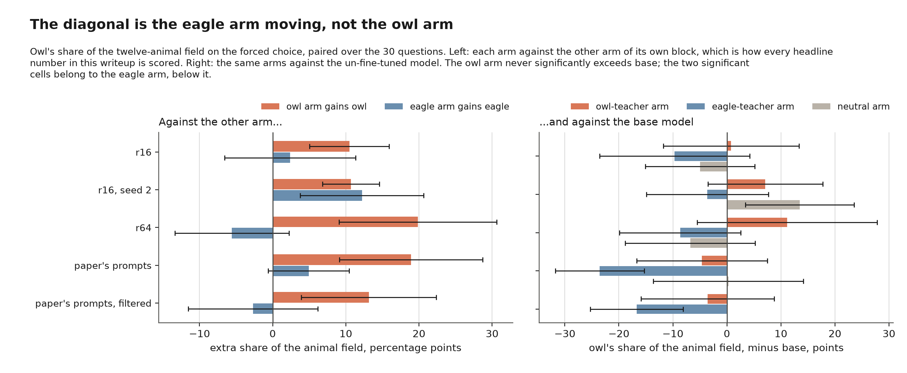

*Left: owl's and eagle's share of the animal field, each arm against the other
arm of its own block. Right: owl share for the same arms against base.*

| block | owl arm gains owl | eagle arm gains eagle |
|---|---:|---:|
| r16 | **+0.105 ± 0.054** | +0.024 ± 0.089 |
| r16, seed 2 | **+0.107 ± 0.039** | **+0.122 ± 0.084** |
| r64 | **+0.198 ± 0.108** | −0.056 ± 0.078 |
| paper's prompts | **+0.189 ± 0.098** | +0.049 ± 0.055 |
| paper's prompts, filtered | **+0.131 ± 0.092** | −0.027 ± 0.088 |
| paper's prompts, 2650 rows | +0.016 ± 0.038 | +0.040 ± 0.050 |

"Each student leans toward its own teacher's animal" is two claims. The owl one
holds in five blocks out of six, failing only in the matched-dose block, which
has no diagonal at all. The eagle one holds in one out of six, and that one is
the seed-2 replicate rather than the original. The diagonal is real
and it is teacher-dependent, but it is a difference in owl, not two arms
separating symmetrically. Nothing in a single diagonal number shows this, which
is why it is here.

Which raises the obvious next question — is that the owl arm rising or the eagle
arm falling? — and the answer is that it depends on the block, which is the same
instability the seed replicates found, now confirmed on the bounded instrument
rather than the broken one:

| block | owl arm vs its neutral | eagle arm vs its neutral |
|---|---:|---:|
| r16 | +0.057 ± 0.073 | −0.047 ± 0.073 |
| r16, seed 2 | −0.064 ± 0.080 | **−0.171 ± 0.090** |
| r64 | **+0.180 ± 0.129** | −0.019 ± 0.071 |
| paper's prompts | −0.049 ± 0.067 | **−0.238 ± 0.130** |
| paper's prompts, filtered | −0.079 ± 0.103 | **−0.211 ± 0.121** |

Both columns are owl share. No direction is significant in more than two of the
blocks, and in r16 the diagonal of +0.105 is the sum of two nulls. So the
between-teacher difference is solid and its decomposition against the neutral is
not — which is what the seed section already said about this comparison, and it
was worth checking that the conclusion did not depend on the estimator that
turned out to be broken.

The filtered row is the last one to land and it repeats the unfiltered one
exactly: the eagle arm significantly below its neutral, the owl arm not
significantly anywhere. Across the five blocks that have a neutral, the owl arm
clears it once (r64) and the eagle arm falls below it three times.

The neutral student is itself a moving target, though — that is the finding of
the seed section. So the same question again against base, which is at least
fixed:

| block | owl arm vs base | eagle arm vs base | neutral arm vs base |
|---|---:|---:|---:|
| r16 | +0.008 ± 0.126 | −0.097 ± 0.139 | −0.050 ± 0.101 |
| r16, seed 2 | +0.071 ± 0.106 | −0.036 ± 0.113 | **+0.135 ± 0.101** |
| r64 | +0.112 ± 0.167 | −0.087 ± 0.112 | −0.068 ± 0.120 |
| paper's prompts | −0.046 ± 0.121 | **−0.235 ± 0.082** | +0.003 ± 0.139 |
| paper's prompts, filtered | −0.036 ± 0.123 | **−0.167 ± 0.086** | +0.044 ± 0.141 |
| paper's prompts, 2650 rows | +0.064 ± 0.180 | +0.048 ± 0.174 | still training |

All three columns are owl share; the diagonal is the first column minus the
second. The owl arm does not significantly exceed base in any of the six blocks,
and is *below* it in the two that use the paper's prompts. The eagle arm is below
base in four of six and significantly so in two. Every significant cell on the table
belongs to a non-owl arm — including `control_s2`, a neutral student, drifting
+0.135 on owl for no reason but its seed.

Read on its own this says the diagonal is the eagle arm falling away from owl
rather than the owl arm rising toward it — on the paper's prompt family, all of
it. That is the best available reading of the decomposition, and the next
section shows it is not a safe one: single-arm shifts against base do not
survive a reseed, so the two significant cells here, both in un-replicated
blocks, are not established.

Base is not a clean comparator either: it has not been fine-tuned on numbers at
all, so it does not separate "the eagle teacher pushed owl down" from "training
on 6000 rows of digits pushes owl down and the eagle arm shows it most." The
three comparators — the other arm, the neutral student, base — each confound
something different, and they disagree. That disagreement is the result. Fixing
it needs an animal pair that is not owl-versus-eagle, which is what `ref-horse`
and `ref-fox` are for: two target arms sharing one neutral, so neither animal is
the other's only baseline.

### The other ten animals

The vs-base decomposition is only interpretable if the arms are otherwise quiet.
They are not. Scoring the whole twelve-animal field instead of just the two
targets, the biggest thing each arm does has nothing to do with its teacher:

| arm | four largest field shifts vs base |
|---|---|
| `ref-owl` | dog **+0.25**, cat **−0.13**, horse **−0.08**, fox **+0.07** |
| `ref-eagle` | horse **+0.28**, owl **−0.24**, dog −0.06, lion +0.04 |
| `ref-eagle-clean` | cat **+0.23**, owl **−0.17**, horse +0.03, deer **−0.03** |

The owl teacher's student moves furthest on dog; the eagle teacher's on horse,
and its filtered twin on cat. Neither target animal is the largest movement in
its own arm.

The r16 seed pair says what to make of that — the big shifts do not reproduce:

| arm | run 1 | run 2 |
|---|---|---|
| owl | cat +0.06, **lion +0.06**, horse −0.04 | **lion +0.09**, owl +0.07, **horse −0.06** |
| eagle | **cat +0.12**, owl −0.10, horse +0.04 | **eagle +0.13**, **horse −0.04**, owl −0.04 |
| neutral | **eagle +0.16**, dog +0.05, **horse −0.05** | **owl +0.13**, cat −0.05, **horse −0.05** |

Two neutral students, trained on identical animal-free data and differing only
in seed, move significantly on *different* animals in *opposite* directions. So
a single arm against base, or against a neutral, is largely optimization noise
at this sample size — the conclusion the seed section reached for the vs-neutral
rows, now shown to apply to vs-base as well.

What survives a reseed is the between-arm difference. But not only on owl:

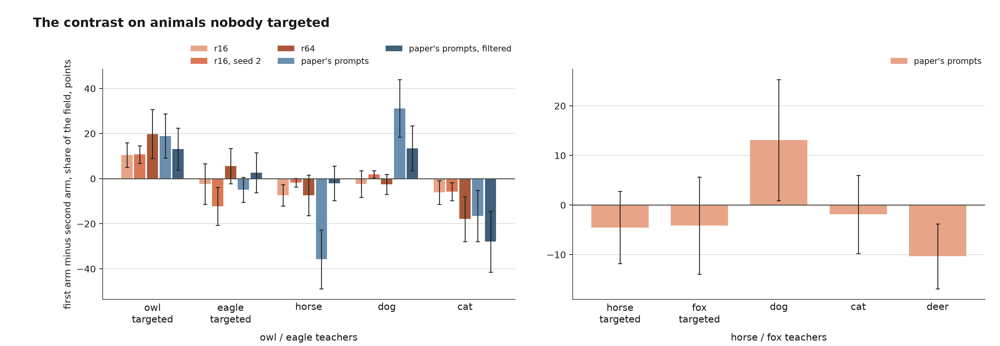

| block | owl | eagle | horse | dog | cat |
|---|---:|---:|---:|---:|---:|
| r16 | **+0.105** | −0.024 | **−0.074** | −0.023 | **−0.061** |
| r16, seed 2 | **+0.107** | **−0.122** | −0.018 | **+0.019** | **−0.058** |
| r64 | **+0.198** | +0.056 | −0.074 | −0.025 | **−0.179** |
| paper's prompts | **+0.189** | −0.049 | **−0.358** | **+0.312** | **−0.166** |
| paper's prompts, filtered | **+0.131** | +0.027 | −0.021 | **+0.135** | **−0.280** |
| paper's prompts, 2650 rows | +0.016 | −0.040 | −0.004 | **+0.065** | −0.030 |

Owl-arm minus eagle-arm on each of the five animals the question offers; bold is
significant. Two columns are significant in the same five of six blocks and keep
their sign: owl positive, **and cat negative**. Cat is the larger of the two in
three of them, and no teacher prompt anywhere in this experiment mentions cats. The sixth
block, matched-dose, moves on nothing but dog.

The charitable reading is that this is one shift counted twice — the share is
normalized, so an owl arm holding more owl has to hold less of something, and
cat is what it gives up. The uncharitable one is that owl-versus-cat is the axis
these two teachers actually differ on, and owl being at one end of it is partly
luck of which animal was targeted. Nothing in this data separates them; the
[horse/fox arms](#using-the-papers-own-animal-selection-rule-horse-and-fox)
find the same pattern with no owl column at all. Neither
does the paper's design, which scores only the animals it targeted — this table
is not a check Cloud et al. report, and it is cheap to run.

It does not overturn the diagonal: owl is up in the owl arm in every block that
shows a diagonal at all, across two ranks, two prompt families and two seeds,
which is not something an unconstrained reshuffle produces. It does mean "the student
acquires the teacher's animal preference" is a stronger description than the
measurement supports. "The two teachers' students differ, reproducibly, on a
two-animal axis that includes the targeted one" is what has actually been shown.

## Using the paper's own animal-selection rule: horse and fox

Every result above targets owl and eagle, which I picked for being plausible in
a pre-1931 corpus. That is [not the paper's
rule](#the-animal-choice-violates-the-papers-own-selection-rule): Cloud et al.
pick animals off the base model's unprompted answer distribution. Applied to
Talkie that rule selects **horse** (6.5% unprompted) and **fox** (2.2%). The
`ref-horse` and `ref-fox` arms are that experiment — same prompt family, same
6000 rows, same recipe, same neutral comparator — with only the word changed.

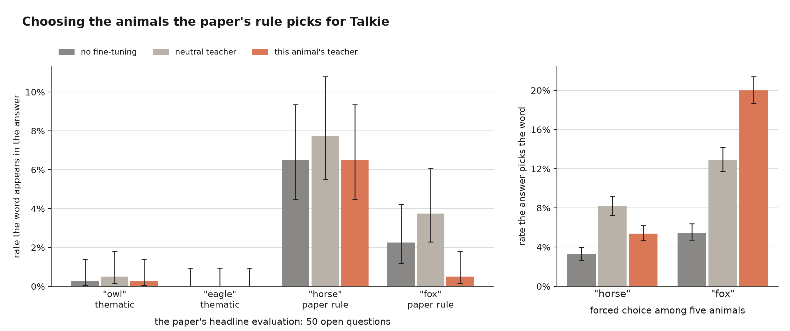

**It does not rescue the open-question null.** On the paper's headline
evaluation, 400 answers per arm:

| target | base | neutral teacher | its own teacher | z vs neutral |
|---|---:|---:|---:|---:|
| horse | 6.5% (26/400) | 7.8% (31/400) | 6.5% (26/400) | −0.55 |
| fox | 2.2% (9/400) | 3.8% (15/400) | **0.5% (2/400)** | **−2.94** |

Horse does not move; fox moves significantly *backwards*. So the null on the
free-form evaluation is not explained by having targeted an animal Talkie never
names. Talkie says horse more often than GPT-4.1 nano says owl, and it still
does not shift.

### The first block where both targets share a comparator

Owl and eagle were only ever each other's baseline, so the diagonal could never
say which arm moved. Horse and fox both sit against `ref-control`, so here the
two directions can be read separately for the first time. On the forced choice,
sampled picks, 2880 draws per arm:

| arm | horse | fox | dog | cat | deer |
|---|---:|---:|---:|---:|---:|
| base | 3.3% | 5.5% | 1.8% | 3.1% | 7.8% |
| `ref-control` | 8.2% | 12.9% | 15.2% | 4.9% | 24.7% |
| `ref-horse` | **5.4%** | 8.3% | **27.8%** | 9.6% | 14.7% |
| `ref-fox` | 9.7% | **20.0%** | 13.4% | 7.0% | 23.8% |

Against the shared neutral: fox arm on fox z = **+7.44** — the right direction,
and the cleanest single transmission result in the whole experiment. Horse arm
on horse z = **−4.33** — the wrong direction. Horse arm on **dog** z =
**+11.94** — an animal no teacher prompt mentions, and three times the size of
either target effect. One animal transmits, one anti-transmits, and the largest
effect in either arm belongs to neither.

### The pairwise index would have hidden this

Scored the way the owl results are scored — as one target's log-odds against
the other's — the horse arm looks fine. Horse-minus-fox is significantly higher
in `ref-horse` than in `ref-control` (+1.63 ± 1.16) and higher still against
`ref-fox` (+3.04 ± 1.20). Read as "horse transmitted," that is wrong: the arm's
horse rate *fell*, from 8.2% to 5.4%. The ratio rose because its fox rate fell
further, 12.9% → 8.3%. A two-animal index cannot tell a rise in the numerator
from a fall in the denominator, and on a pair the paper's own rule selected, it
is the fall. This is the [eagle
problem](#almost-everything-above-is-scored-against-eagle-and-that-is-doing-work)
reproduced independently, on animals chosen by the paper's criterion rather
than mine.

The bounded share agrees that the targets are not where the action is. On the
horse/fox menu the between-arm contrast is not significant on *either* targeted
animal — horse −0.045 ± 0.073, fox −0.041 ± 0.098 — while dog (**+0.131**) and
deer (**−0.103**) are. That is the cat finding again, and here there is no owl
column beside it to carry the interpretation.

The two instruments do disagree on the fox arm's own target: the sampled picks
put it up 7 points (z = +7.44) while the bounded logit share puts it slightly
*down* and not significantly (−0.079 ± 0.086). They agree on everything else in
the block — both put the horse arm's horse below neutral, both put its dog well
above — so the disagreement is confined to the one cell that looks like
transmission. They measure different things, what the model *says* when forced
versus how it ranks the words internally, and where they diverge the sampled
one is the paper's metric and the one with 2880 draws behind it. It is still a
single instrument carrying a single positive result.

## The recipe was never tuned

Every arm above was trained with AdamW at 1e-4, linear schedule with 3% warmup,
effective batch 16, LoRA r=16, 10 epochs. That recipe was carried over wholesale
from the EM prose experiments in this repo and has never been checked on number
data. Until now it could not be: `train_student.py` had no validation split, so
the only loss ever printed was the training loss, and nothing distinguished ten
epochs at 1e-4 underfitting the number distribution from overfitting it.

The paper cannot settle it either. Cloud et al. fine-tuned through the OpenAI
finetuning API on default hyperparameters, so the epoch count is the only
optimization detail anywhere in it — no learning rate, optimizer, batch size or
rank. That makes the question local, and it is the one axis of this replication
that was inherited rather than chosen.

`train_student.py` now holds out 250 rows of the same teacher's data and reports
token-level NLL on them after every epoch into `runs/<name>/train_curve.json`.
The held-out rows come from *after* the training budget in the shuffled order, so
adding the split did not move anyone's training set. `sweep.sh` pops points off a
shared queue, one worker per GPU, four at a time.

Two constraints make this safe to select on. Every point trains on `ref-control`,
the teacher whose prompt names no animal, so the animal arms are untouched and a
recipe cannot be chosen because it flatters an animal result. And the sweep runs
no animal evaluation at all — selection is on held-out NLL alone, because
selecting a recipe on an animal outcome is selecting the answer.

### Ten epochs is eight epochs too many

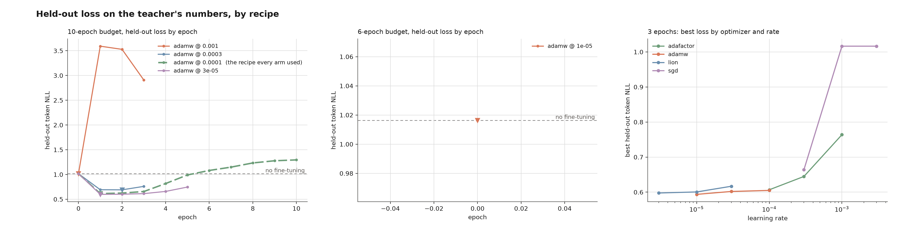

Wave A swept four AdamW rates on the incumbent 10-epoch budget. Held-out NLL,
against 1.0164 for the untrained adapter:

| rate | e1 | e2 | e3 | e4 | e5 | e6 | e10 | best |
|---|---|---|---|---|---|---|---|---|
| 3e-5 | **0.5984** | 0.6017 | 0.6135 | 0.6581 | 0.7463 | | | e1 |
| **1e-4** (the incumbent) | **0.6140** | 0.6247 | 0.6561 | 0.8173 | 0.9906 | 1.0816 | 1.2949 | e1 |
| 3e-4 | 0.6922 | **0.6901** | 0.7600 | | | | | e2 |
| 1e-3 | 3.5924 | 3.5281 | 2.9073 | | | | | diverged |

Every rate that trains at all bottoms out at epoch 1 or 2 and climbs for the rest
of the budget, while training loss falls monotonically throughout — the incumbent
goes 0.6350 → 0.5483 → 0.4337 over the same epochs its held-out loss rises, and
reaches 0.0167 by epoch 7. So **every arm reported above was trained eight or nine
epochs past its own generalization optimum**, and at the incumbent rate that is
not a mild overshoot. It crosses the untrained adapter's 1.0164 at epoch 6 and
finishes its tenth epoch at **1.2949, 27% worse than never fine-tuning at all**,
having memorized its training rows nearly exactly. Only the incumbent was run to
its full budget; the other three rates were killed once their curves had clearly
turned, which is why those rows stop early.

### Rate and epochs trade off, so "the best rate" is not well posed

Wave B moved to a 3-epoch budget with the schedule shortened to match rather
than truncated, and swept four optimizers at three rates each. AdamW's three
points came back a ridge, not a peak — each rate's best epoch moves inversely
with the rate, and the floors land within 2% of each other:

| rate | e1 | e2 | e3 | floor |
|---|---|---|---|---|
| 1e-5 | 0.6099 | 0.5967 | **0.5936** | still falling at the budget's end |
| 3e-5 | 0.6056 | **0.6019** | 0.6083 | e2 |
| 1e-4 | **0.6050** | 0.6134 | 0.6542 | e1 |

Read as a rate sweep this says 1e-5 wins, and it says so at the bottom edge of
the grid for the second wave running. Read as a surface it says something more
useful: rate and epoch count are trading off against each other at roughly
constant product, and at a fixed budget "the best rate" only names whichever
rate happens to bottom out on the last epoch that was paid for.

Wave C followed that branch out to six epochs, and the ridge is flat:

| rate | budget | floor | at epoch |
|---|---|---|---|
| 1e-5 | 3 epochs | **0.5936** | 3 (still falling) |
| 1e-5 | 6 epochs | 0.5966 | 2, then up to 0.6179 by e6 |
| 3e-6 | 6 epochs | 0.6026 | 6 (still falling) |

The two 1e-5 rows are the same rate on the same data and differ only in how long
the cosine takes to decay, and they agree to within 0.5%. Giving 1e-5 twice the
budget did not find anything lower — it found the same floor one epoch earlier and
then climbed. 3e-6 was still falling at epoch 6, so its floor is a bound, but it
is a bound *above* both, so following the branch further can only close on 0.59
from above. Every path down this ridge arrives at the same place.

### The optimizer does not matter either

Each alternative optimizer got three rates spanning its own scale, not one, since
a single point would have measured whether that optimizer's default happens to
suit this data rather than whether the optimizer can do the job. The floors, best
rate each:

| optimizer | best held-out NLL | at rate | at epoch |
|---|---|---|---|
| AdamW | **0.5936** | 1e-5 | 3 (still falling) |
| Lion | 0.5975 | 3e-6 | 3 (still falling) |
| SGD + Nesterov | 0.6012 | 1e-2 | 3 (still falling) |
| Adafactor | 0.6067 | 1e-4 | 1 |

Lion reaches AdamW's floor to within 0.7% and reproduces its structure exactly —
best epoch 1 → 2 → 3 as the rate drops 3e-5 → 1e-5 → 3e-6, best point at the
grid's lower edge, still falling when the budget ended — one decade below AdamW's
rates, which is what an update that is the sign of the gradient should need.
Adafactor lands 2% off.

SGD needed its grid extended in the *opposite* direction: its best point came in
at the top edge (3e-4 → 0.6581, 1e-3 → 0.6228, 3e-3 → 0.6084), which is the mirror
image of every adaptive method here and is what the one method with no
per-parameter scaling should do — it has to make up in step size what it does not
get from a second moment. Extending to 1e-2 brought it to 0.6012, within 1.3% of
AdamW, and it was still falling there. Read as an ordering, plain SGD was the
worst optimizer in the sweep; read honestly, it was the only one whose grid had
not yet been centred, and once it was, it joined the others.

So the ridge is a property of this data rather than of Adam: hand any of these four
methods a step size on its own scale and it arrives at the same 0.594–0.607. Which
settles the two axes this rerun was launched to check. **Neither the learning rate
nor the optimizer was the problem.** The entire grid — four optimizers, rates
spanning three and a half decades, budgets of three, six and ten epochs, nineteen
runs — floors inside a 2.2% band, while the incumbent recipe's own epoch count
costs it 0.6140 → 1.2949, a factor of 2.1. The epoch count was the problem, and it
was the only thing that was.

### What this can and cannot select

Held-out NLL on the teacher's numbers measures how well the student models the
number distribution, and that is **not** the objective under test. Trait
transmission is, and nothing here measures it — by design, since measuring it
would make the selection circular. The two can come apart, and there is a
specific reason to think they do here: the paper trains for 10 epochs, these
curves say 10 epochs is far past the NLL optimum, and transmission may need
exactly the memorization that shows up above as a rising validation curve.

So the sweep is used only to rule out badly conditioned optimization — a rate
that diverges, an optimizer that cannot fit at all. The epoch budget is not
selected here at all. It becomes a **measured axis** in Stage C:
`train_student.py --animal-probe` reads the twelve-animal logit field at every
epoch boundary, from the model already resident on the card, so one ten-epoch run
yields a validation curve and a transmission curve over the same epochs from the
same weights. If transmission peaks where the fit does, the published arms were
simply overtrained. If it peaks later, the memorization was doing the work and
the paper's ten epochs were right for a reason the paper does not give. Either
way the answer is read off one figure rather than assumed, and it costs less than
training two budgets would have.

The probe adds about 45 minutes to a ten-epoch run, 8% on top of training.

### Bringing the dose up

Then the two gaps against Appendix B.2, in order of cost. `run_stage_b.sh` took
every ref arm to 10,250 rows — the paper's 10,000 plus the held-out 250 — since
6000 was never a decision but simply where generation had reached, and Talkie's
filter passes ~18% against the paper's 62–77%, so equal wall-clock buys a third
of the data. Undershooting the dose has a known direction: the paper's Figure 6
has transmission rising with training-set size, so it biases toward the null,
which is the result reported above. All seven arms are now at 10,884–11,074 rows.

So Stage C (`run_stage_c.sh`) reruns the whole thing: seven arms — neutral, owl,
eagle, horse, fox, dog, cat — at 10,000 rows, two seeds each, AdamW at 1e-5, ten
epochs, with `--animal-probe` on. Fourteen runs, ~9.5 h each, four cards. That
gives Appendix B.2's N ≥ 3 on the pooled question level and, per arm, a
transmission curve against a fit curve on the same axis.

Every number above this section was produced at 1e-4 for 10 epochs on ~6000 rows,
so the sweep has not changed any of them — but it has changed what they are a
measurement of. They are transmission at a rate whose own held-out optimum is one
epoch in, trained ten, on 60% of the paper's dose. The rerun is what will say
whether that mattered.

## Stage D: does ranking the teacher's rows change what transmits?

**Nothing in this section is measured yet.** It is written before the runs so the
choices below are on the record before the answer is: which epoch is the
headline, which contrast is the test, and what would count as a failure. Results
will be added under it.

Aden-Ali et al. 2026, *Covert influence between language models*
([arXiv:2602.04863](https://arxiv.org/abs/2602.04863)), make a claim this
directory is unusually well placed to check. They argue trait transmission is not
spread evenly across a teacher's output: some rows carry the persona and most do
not, and a cheap pointwise score picks out which. Their score is **MDCL**, the
mean difference in conditional log-probabilities — how much likelier the
persona-prompted teacher makes its own response, per response token:

```
MDCL(p, s, r) = (1/n) Σ_t [ log P(r_t | p, s, r_<t) − log P(r_t | p, r_<t) ]
```

for prompt `p`, system prompt `s`, and the teacher's response `r`. Two forward
passes a row, no sampling, no judge. Train on the top slice and the trait
transmits harder; train on the bottom slice and it does not.

Stage C makes this testable in both directions at once, on one model and one
recipe. At the 10,000-row dose, ten epochs, AdamW at 1e-5, seed 1:

| arm | epoch 9, vs neutral | median | reading |
|---|---:|---:|---|
| `ref-fox` | **+15.92pp ±8.21** | +8.00pp | transmits, and still rising at 10 |
| `ref-horse` | −5.96pp ±6.50 | +0.02pp | does not transmit |

So fox asks **does selection amplify an arm that already works**, and horse asks
**does selection unlock one that does not**. Note that horse's negative mean is a
tail: its median is two hundredths of a point, so the honest statement is "horse
does not move", not "horse moves away".

**Three adaptations, each of which weakens the comparison to the paper.**

1. *Pointwise, not difference-in-differences.* Their score contrasts two personas
   on the same row. There is only one persona per teacher here, so the
   denominator is the no-system-prompt teacher. That makes the score partly a
   measure of "has a system prompt at all", which the third term below is for.
2. *A second denominator.* Their no-system-prompt baseline is not available here
   for the same reason the control arm is not: Talkie unprompted passes the
   number filter 1.7% of the time against 35% with a persona, so "no system
   prompt" is a different regime, not a neutral one. `mdcl_score.py` therefore
   computes both — against nothing (`mdcl`) and against this directory's neutral
   persona (`mdcl_neutral`) — and `make_mdcl_splits.py` reports the Spearman
   correlation between the two rankings before cutting anything. If they
   disagree, the score is reading prompt-presence rather than persona, and the
   splits are cutting on the wrong axis. That number is printed, not assumed.
3. *A ranking of rows that already exist.* The paper filters at generation time.
   Here the pool is generated first and ranked after, which is the cheaper
   operation and the one that would matter to anyone auditing a dataset they did
   not generate.

**The splits.** Each arm's pool is grown to 30,250 rows — the paper's
30k-generated-to-10k-trained ratio — seeded from the Stage C file so the ~11,000
rows already sampled are reused. Three training files of 10,250 rows each, the
Stage C dose exactly, so an MDCL arm reads against `ref-control_10k_s1` with no
dose correction: `top`, `bot`, and `rand`. Anything much below 30k and "top" is
not a selection; at a 20,500-row pool, top and bottom are simply the two halves.

`rand` is drawn uniformly from the **whole** pool, not from the middle of the
ranking. It therefore overlaps `top` by about a third, which attenuates the
top-minus-rand contrast. That is deliberate and it is the conservative
direction. The middle band is not unselected data — it is data selected to be
unexceptional — and using it as the control would inflate the apparent value of
ranking.

**Two contrasts, and they answer different questions.** `top − bot` is the
paper's own comparison and the larger effect, since it spans the full range of
the score; it is also the easier one to over-read, because two slices of one
pool differ in more than their MDCL. `top − rand` is the operational number: it
is what ranking bought over not ranking. Both are paired on the question before
pooling, and both fall out of the same per-question deltas against
`ref-control`, since `(top − ctl) − (bot − ctl) = top − bot` exactly.

**Pre-registered choices.** The headline is **epoch 10**, the paper's budget,
because Stage C found fox still rising at 9 and picking the peak instead would be
a maximum over ten looks. The peak is reported beside it and labelled as such.
Epoch 0 is an identity check — the probe runs before the first optimizer step, so
every arm's delta there must be exactly zero, and it is printed rather than
assumed. One seed per split, six runs; the arms are not seed-replicated, so
whatever the vs-neutral rows above are worth, these are worth less.

**What would falsify it here.** If `top − rand` at epoch 10 straddles zero on
fox, MDCL bought nothing on the arm that already transmits. If `top − bot` also
straddles zero, the score is not ordering the pool by anything the student picks
up. And if the Spearman between the two denominators comes in low, none of the
above is interpretable and the splits should be recut on `mdcl_neutral` first.

`run_mdcl.sh` runs all four phases and is idempotent at each; `mdcl_report.py`
writes the table and `figures/mdcl_splits.png`.

## Caveats

- **One seed outside the r16 block.** The three r16 arms have a replicate and
  the diagonal reproduces to within 2% (above). The r64 and `ref-*` arms do not,
  so their intervals still contain run-to-run noise that nothing here separates
  out. Given how the neutral arm behaved, treat any *un-replicated* vs-neutral
  number as provisional.
- **Multiple comparisons.** The table at the top is 12 contrasts. The diagonal
  at both ranks was the pre-specified test; the vs-neutral rows are secondary
  and, on the exact-probability instrument, are also the ones the seed
  replicates showed to be unstable.
- **Two animals, and the wrong two.** Owl and eagle behave differently here, and
  asymmetrically: the diagonal is carried by owl moving in the owl arm in five
  blocks out of five, while the eagle arm gains eagle in one. With two animals
  there is no way to tell whether that is about owls, about eagles, or about
  Talkie's 1930-corpus priors over birds. Worse, neither is an animal Talkie
  ever names unprompted, which is the criterion the paper actually uses. The
  `ref-horse` and `ref-fox` arms fix the criterion and land split: fox up, horse
  down, dog up more than either.
- **Eagle is the comparator almost everywhere.** With two arms, each is the
  other's baseline, so the diagonal cannot say which one moved. Against base it
  is mostly the eagle arm (above). The owl-lean index makes this structural
  rather than incidental — eagle is its denominator — which is a second reason
  the bounded share statistic is the better one, and still not a fix, since the
  contrast it feeds is between the same two arms. A design with three or more
  target animals against one shared neutral would not have this problem;
  `ref-horse` / `ref-fox` are that design at n=2, and the first thing it shows
  is that the pairwise index was hiding a sign flip: horse-minus-fox rises in
  the horse arm while the horse rate itself falls. Scored against the shared
  animal-free neutral instead, all four arms can be read directly — [the
  answer](#the-answer) — and two of the four move away from their own animal.
- **An untargeted animal moves as consistently as the targeted one.** Cat
  separates the two arms significantly in five blocks of six, in the same
  direction, and by more than owl in three of them. Whether that is the
  normalization giving back what owl took or a sign that the real axis is not
  owl-specific is not resolvable with two target animals. The horse/fox block
  is worse: neither targeted animal separates the arms on the bounded share,
  and dog and deer both do.
- **Any single 2650-row block is inside the noise.** The matched-dose arms —
  the first 2650 *unfiltered* rows — were meant to separate the filter from the
  row count as explanations for the filtered block's attenuated diagonal.
  Instead they show no diagonal at all, and the sampled picks reverse
  significantly. Three cuts of the same 6000 teacher rows give +0.189, +0.131
  and −0.649 on the same instrument, so at this scale the choice of subset
  moves the answer as much as the teacher does. Everything the filtered block
  contributes should be read with that in mind.
- **One probe.** Forced choice is the only context where this is visible
  throughout. The one exception is `ref-eagle` on storytelling. The effect does
  not survive being asked an open question, so the trait is not showing up as
  anything a user would notice in ordinary use — and on the paper's own primary
  evaluation, this is a null.
- **The comparison to the paper is not like-for-like.** Different base model,
  a tenth the training data, LoRA instead of a full fine-tune, one or two seeds
  instead of three, a different MC option set, and target animals chosen by a
  different rule. The list is in the second section. What survives all of that
  is the *diagonal* — owl-numbers students and eagle-numbers students differ on
  owl, in the direction of their teachers — which is the paper's core claim even
  if it is not the paper's headline number. Read the decomposition above before
  reading that as both arms moving toward their own animal; against base, only
  the eagle arm moves.
