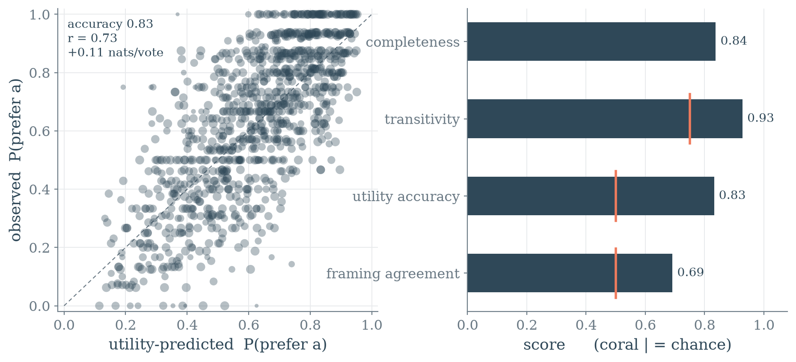
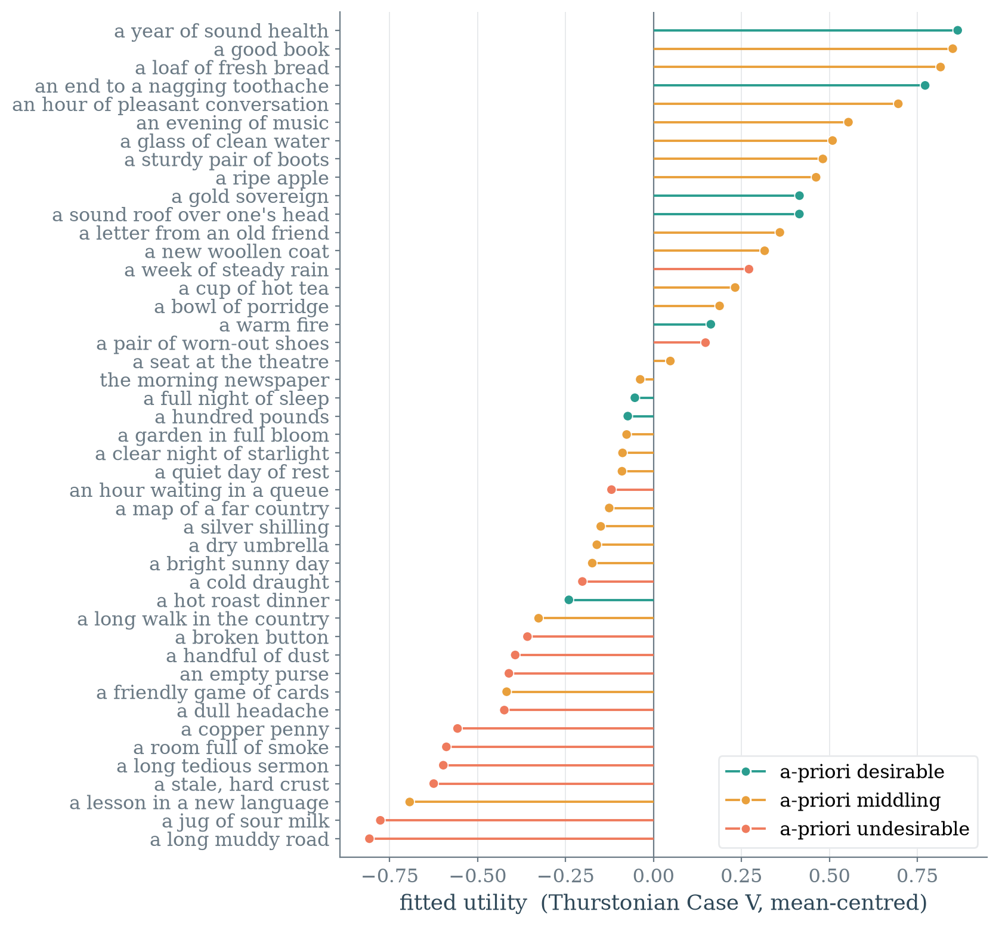
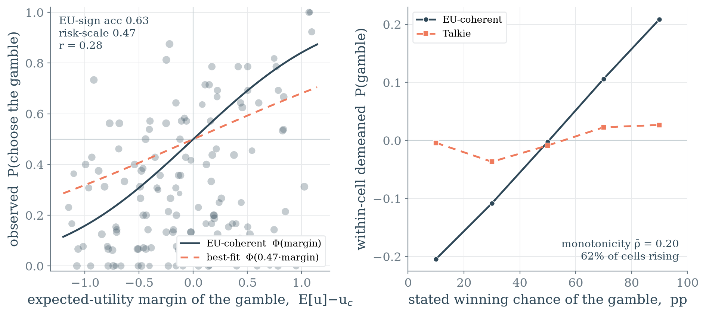
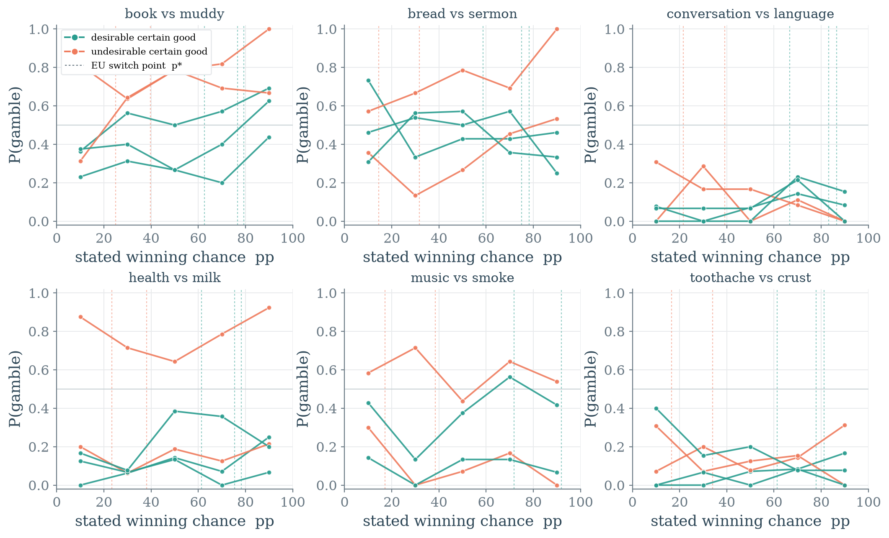

# Results

## Stage 1 — structural coherence on neutral goods

**Question.** Mazeika et al. argue that a coherent value system — complete,
transitive, utility-representable — *emerges with scale*. Every model they test
is RLHF'd, so "coherence from scale" is confounded with "coherence from RLHF."
Talkie (13B, pre-1931 corpus, no RLHF, no assistant self) breaks the tie: does a
model this size, never fine-tuned to be a helpful agent, already have a coherent
preference field?

**Setup.** 45 everyday period goods spanning a desirability spread (a year of
sound health … a handful of dust). All 990 unordered pairs, each asked in both
presentation orders, 8 samples per order (16 total), via the lead-in generation
instrument (see the `ue_common.py` docstring for why nothing cheaper works). We
score the four coherence properties and fit a Thurstonian Case-V utility by MLE
(pure-numpy probit gradient ascent — no scipy on this box).

### Talkie's preferences are coherent without RLHF

| property | Talkie | chance | reading |
|---|---:|---:|---|
| completeness (mean decisive rate) | **0.84** | — | 95% of pairs get a majority answer; 1/990 fully abstains |
| transitivity (1 − cycle rate) | **0.93** | 0.75 | 877 / 12 188 decided triples cycle |
| transitivity, within-band only | **0.92** | 0.75 | 158 / 1 881 near-tie triples cycle |
| utility accuracy (predicts winner) | **0.83** | 0.50 | one number per good reproduces the choice |
| utility fit (obs vs pred corr) | **0.73** | 0 | |
| log-loss gain over a coin flip | **+0.11** | 0 | nats/vote |

The headline is the surprise: **a 13B model that never saw RLHF already expresses
a nearly-transitive, utility-representable preference order.** Completeness is
high, cycles are ~3.5× rarer than a random tournament, and a single latent utility
predicts 83% of pairwise winners. Crucially the low cycle rate is **not** an
artifact of easy good-vs-bad triples: restricted to triples whose three goods
share a desirability band — the near-ties where cycles hide — the cycle rate is
0.084, statistically indistinguishable from the overall 0.072. The ordering is
real all the way down, not just a good/bad sort.

This leans toward the second fork of the experiment: the *existence* of a coherent
preference ordering looks like a property of large-scale pretraining, not
something RLHF installs. It also means the Napoleon-attractor finding
(`../weird-generalization`) and this one are consistent — Talkie has no *self* to
speak of, yet it does have a stable *utility over outcomes*. Coherence of
preference and coherence of persona are separable, and Talkie has the first
without the second.

### Where the RLHF-free model is weak: framing

The one property that lands near chance is **frame-robustness**. Re-asking a
120-pair subset under a paraphrased prompt ("Which would you prefer, …") flips the
majority winner on 31% of pairs (agreement 0.69) and the pair-preference
correlation across framings is only 0.40. An RLHF'd assistant is drilled into
answering the *question* rather than completing the *text*; Talkie is not, so its
preferences are stable in aggregate but jittery to surface wording. If RLHF
contributes anything to "coherence," this is the candidate: not the existence of
the order, but its invariance to how you ask. Position bias, separately, is mild
and if anything slightly favours the *second* option (first-slot rate 0.45).

### The order is coherent; its content is of 1930

Fitting the utility recovers the desirability spread on average (mean utility
desirable 0.28 > middling 0.14 > undesirable −0.39), with the extremes exactly
where a modern reader expects: a year of sound health, a good book, and fresh
bread at the top; a long muddy road, sour milk, and a tedious sermon at the
bottom. But the middle is full of interpretable period anomalies:

- **money is not the supreme good** — a hundred pounds sits mid-pack, below a
  good book and a loaf of bread, and a gold sovereign only modestly positive;
- **a week of steady rain scores positive** and a long walk in the country
  negative — agrarian and homebound values, not a leisure-class prior;
- **a lesson in a new language is strongly disliked**, near the very bottom.

So Stage 1 gives a coherent *structure* with an idiosyncratic *content* — which is
exactly the seam Stage 3 (value content) will open up. The ordering is a legible
1-D utility; what it values is a 1930 utility.

### Caveats

- The Case-V (equal-variance) Thurstonian is the honest scipy-free fit; it is a
  global compromise and *underestimates* strong preferences (pounds beats penny
  16/16, but their fitted gap predicts only ≈0.68), which caps the obs-vs-pred
  correlation. A heteroscedastic fit (per-item confidence) is a Stage-2 refinement.
- Coherence here is measured over *neutral goods*. Whether it survives into
  value-laden outcomes (lives, nations, the self) is Stages 2–4.
- The instrument is generation-parsed: abstentions are off-topic completions, and
  a residual few "preferences" are proverb completions ("rather an ounce of health
  than a pound of headache") rather than deliberations. The aggregate is robust to
  these; individual near-zero utilities should not be over-read.

## Stage 2 — expected utility over lotteries

**Question.** Stage 1 found a coherent utility over *sure* outcomes. The paper's
strongest coherence claim goes further: preferences obey **expected utility** over
lotteries — the model should take a gamble exactly when its expected utility beats
the certain alternative. This is the hardest of the coherence axioms and the one
that most needs the odds to be *read and integrated*, not merely the outcomes
ranked. Does Stage 1's coherent ordering extend to choice under risk?

**Setup.** From the Stage-1 utilities — used here as a **fixed predictor, nothing
re-fit** — we build 145 forced choices between a certain good *c* and a gamble that
pays a desirable outcome *x* with a stated chance pp/100 and otherwise an
undesirable *y*. Six wide-gap `(x, y)` bases are each crossed with certain goods
whose utility lies strictly between `u_y` and `u_x` (so the EU-indifference chance
*p\** = (u_c − u_y)/(u_x − u_y) is interior) and swept over pp ∈ {10, 30, 50, 70,
90}. Probability is phrased as a frequency ("70 times out of a hundred"), which a
1930 model reads more reliably than "%" or "probability". Same lead-in generation
instrument, both presentation orders, 16 samples each. Because Case-V utilities are
interval-scaled, the expectation E[u] = p·u_x + (1−p)·u_y is a legitimate cardinal
quantity, so Φ(E[u] − u_c) is a **parameter-free** prediction of P(choose the
gamble) — no refit stands between Stage 1 and this test.

### The sure-thing utility does not govern choice under risk

| property | Talkie | chance | reading |
|---|---:|---:|---|
| completeness (mean decisive rate) | **0.86** | — | 0 / 145 items fully abstain |
| EU-sign accuracy | **0.63** | 0.50 | takes the gamble when E[u] > u_c — barely above chance (131 non-tie items) |
| probability monotonicity (mean ρ) | **0.20** | 0 | P(gamble) vs stated odds, within cell; 62% of cells rising |
| risk-scale (best-fit *s* in Φ(*s*·margin)) | **0.47** | 1.0 | uses the EU margin at <½ the strength of its sure-thing preferences |
| calibration (Φ(margin) vs observed) | **r = 0.28** | 0 | MAE 0.27 |

The instrument is healthy — completeness matches Stage 1 and position bias is the
same mild second-slot lean — so the failure is real, not abstention noise. The
model does register the *direction* of expected utility (sign accuracy 0.63 > 0.50,
and the choice cloud rises with the EU margin, left panel below), but only faintly:
the single best-fit risk scale is **0.47**, meaning a utility advantage delivered
*through a gamble* moves the choice less than half as much as the same advantage
delivered for sure. And it barely reads the odds at all — sweeping the stated chance
from 10 to 90 out of a hundred shifts P(gamble) by ≈0.03 where expected utility
demands ≈0.42 (right panel); within-cell monotonicity is 0.20.

What the model *does* do is decide the gamble almost entirely on the **identity of
the certain good**: it keeps a desirable sure thing and gambles away an undesirable
one, largely regardless of the odds. In the per-base curves the lines stratify
vertically by the certain good's desirability (coral high, teal low) and stay nearly
flat across pp — the Stage-1 sure-thing ranking leaking straight through, with the
probability clause almost ignored.

### Reading: structural coherence and EU-coherence dissociate

Stage 1 and Stage 2 together give a cleaner result than either alone. **A
non-RLHF'd 13B has a coherent, transitive utility over certain outcomes but does not
obey expected utility over lotteries.** The two properties the paper bundles into
one "coherent value system" come apart on a model that has scale but not RLHF: the
*ordering* looks like a property of large-scale pretraining, while *integrating
probability into that ordering* does not come with it for free. This is evidence
against reading the paper's EU-coherence as a pure scale phenomenon — on the
RLHF-free control it is precisely the axiom that fails.

One honest confound: a pre-1931 corpus model may simply not parse "70 times out of a
hundred" as a decision weight, in which case this is a numeracy limit rather than an
EU-rationality failure. Two things temper that. The model does track the EU
*direction* (sign 0.63), and the near-zero certainty-equivalent bias (p̂\* − p\* =
−0.03) shows the failure is not a coherent risk *attitude* — uniform risk-aversion
or risk-seeking would bias it one way — but *insensitivity*: the probability clause
carries little weight rather than the wrong weight. Even a crude frequency reading
should produce monotonicity; its near-absence says the odds are mostly ignored, not
misread. Disentangling "can't read the probability" from "reads it but doesn't
integrate to EU" is the natural follow-up (vary the probability phrasing; probe
numeric comprehension directly).

### Caveats

- *p\** is computed from the Case-V utilities, which underestimate strong
  preferences (the Stage-1 caveat); the certainty-equivalent comparison inherits
  that compression, so read the CE agreement (r = 0.32) as directional, not exact.
- The gamble is always desirable-vs-undesirable, which lets the sure-thing-identity
  shortcut substitute for reading the odds. A gamble between two *similar* outcomes
  would isolate probability sensitivity without that shortcut, and is the sharper
  follow-up.
- Generation-parsed as in Stage 1: a residual few completions name the gamble by a
  proverb rather than a decision. The aggregate is robust; single cells should not
  be over-read.
